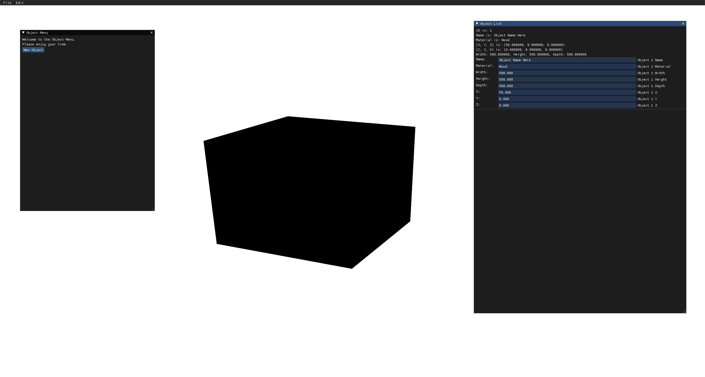

# OpenGL Renderer

A 2D and 3D OpenGL Renderer.

## Controls

| Key/Input | Action |
| :---: | :---: |
| W | Move Up |
| S | Move Down |
| A | Move Left |
| D | Move Right |
| E | Change to 3D Rendering |
| R | Change to 2D Rendering |
| Up_Arrow | Zoom In |
| Down_Arrow | Zoom Out |
| Left_Shift + Mouse | Move Camera whilst in 3D Mode |
| Middle_Mouse + Mouse | Pan Camera |
| Right_Mouse_Button | Show Object Menu |
| Esc | Close Program |
